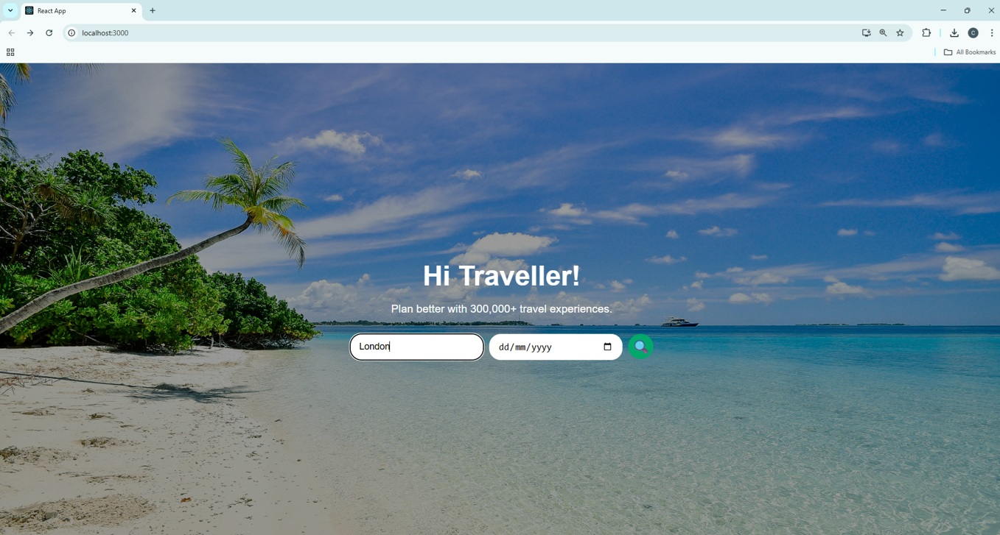
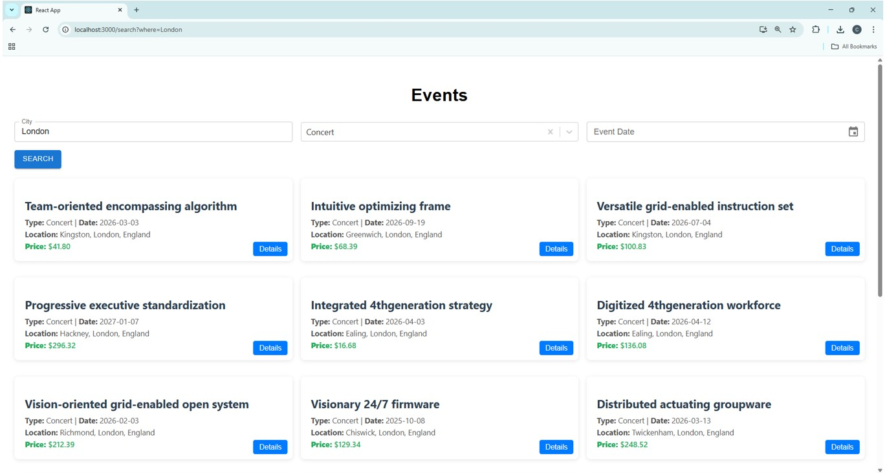
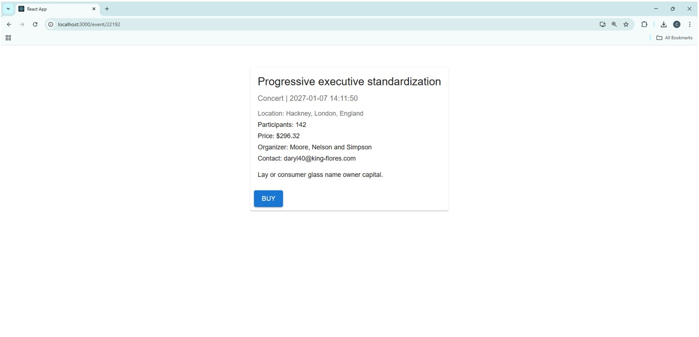

# 🌍 Viator-Style Event Booking App

This project is a full-stack **event booking web application** inspired by Viator / Tripadvisor platforms. It was developed as part of my technical preparation for an interview with Viator.

The main goal was to replicate a realistic booking system using the **same or similar technologies** used by Viator, including **GraphQL**, **Spring Boot**, **PostgreSQL**, and **React with TypeScript**.

---

## Features

-  **Search Events** by city, type, and date
-  Filter results using a date picker
-  View event **details**, including location, price, organizer, and participant count
-  **Buy** or simulate booking an event
-  Optionally **assign events to people as gifts**
-  Uses **GraphQL** for querying event data
-  Simple **REST API** for person and gifting features
-  Dummy events were generated using **AI tools** and stored in **PostgreSQL**

---

## Tech Stack

### Frontend (React + TypeScript)
- React with TypeScript
- Apollo Client (GraphQL)
- React Router DOM
- Material UI & CSS Modules
- Date pickers
- Axios (REST API integration)

### Backend (Java + Spring Boot)
- Spring Boot
- GraphQL
- Spring Web (REST endpoints)
- Spring Data JPA
- PostgreSQL 17
- Maven

### Database
- PostgreSQL 17

---

## Screenshots

### Landing Page

### Search Results Page

### Event Details Page

---

